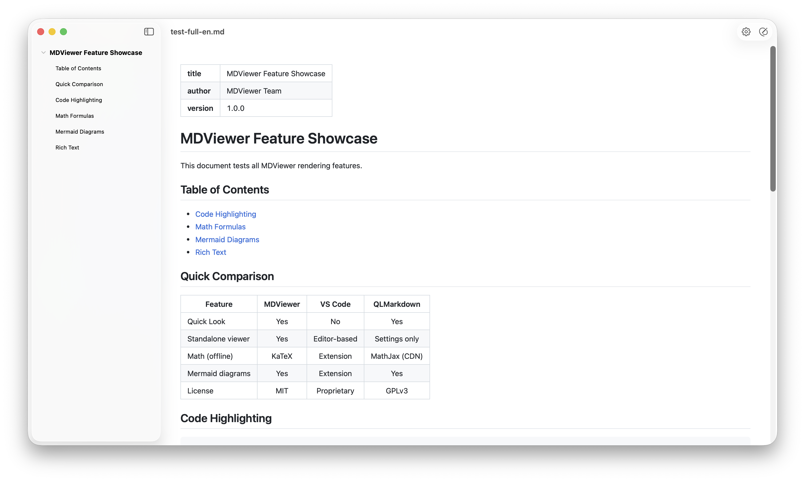
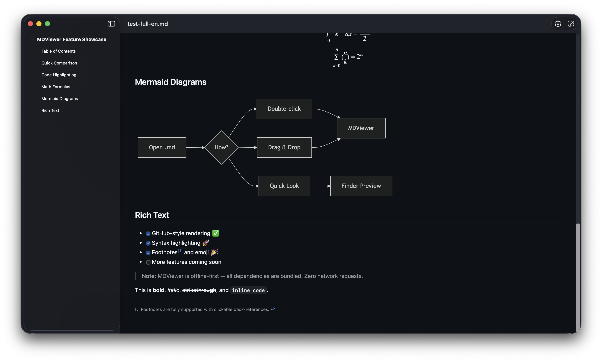

# MDViewer

<div align="center">


   

**A minimal, fast Markdown viewer for macOS — with Quick Look support**

Double-click any `.md` file to see it rendered beautifully, or press **Space** in Finder for an instant preview. No editor overhead, no setup, no waiting. Just read.

[繁體中文](README.zh-TW.md) | English

</div>

---

## Screenshots

<div align="center">

**Light Mode** — GitHub-style rendering with TOC sidebar


**Dark Mode** — Automatic dark theme following system appearance


</div>

---

## Features

- **GitHub-style rendering** — headings, tables, task lists, strikethrough, blockquotes
- **Syntax highlighting** — common languages via highlight.js
- **Math formulas** — `$...$` inline, `$$...$$` display, and ` ```math ` code blocks via Temml (MathML)
- **Mermaid diagrams** — flowcharts, sequence diagrams, etc. (lazy-loaded)
- **Footnotes** — `[^1]` syntax with clickable back-references
- **Emoji shortcodes** — `:rocket:` → 🚀
- **Quick Look** — press Space in Finder to preview any `.md` file, with inline local images
- **TOC sidebar** — collapsible heading navigation with click-to-scroll
- **Export** — save as PDF or self-contained HTML, or print via system dialog
- **CJK support** — full UTF-8 including Chinese, Japanese, Korean
- **Offline** — all dependencies bundled, zero network requests

---

## Keyboard Shortcuts

| Shortcut | Action |
|---|---|
| ⌘O | Open file dialog |
| ⇧⌘E | Open in external editor |
| ⌘E | Export as PDF |
| ⌘P | Print |
| ⌘, | Toggle settings panel |
| ⇧⌘S | Toggle TOC sidebar |
| ← / → | Collapse / expand TOC heading |
| ⌘+ / ⌘− | Zoom in / out |
| ⌘0 | Actual size |
| Space (in Finder) | Quick Look preview |

---

## Install

### Prerequisites

- macOS 14.0 (Sonoma) or later
- Xcode Command Line Tools (`xcode-select --install`)
- [xcodegen](https://github.com/yonaskolb/XcodeGen): `brew install xcodegen`

### One-command install

```bash
git clone https://github.com/ff2248/md-viewer.git
cd md-viewer
make install
```

That's it. `make install` builds the app, copies it to `/Applications`, and enables the Quick Look extension.

> On first launch, macOS may block the app. Go to **System Settings → Privacy & Security → Open Anyway** to allow it.

### Other ways to open files

| Method | How |
|---|---|
| Double-click | Open any `.md` file (after setting as default) |
| Drag & drop | Drop a `.md` file onto the app window |
| CLI | `open -a MDViewer yourfile.md` |

### Set as default viewer

Right-click any `.md` file → **Get Info** → **Open With** → select **MDViewer** → **Change All**.

---

## Architecture

```
MDViewer/                              # SwiftUI app
├── MDViewerApp.swift                  # App entry, menu commands, file handling
├── ContentView.swift                  # Main layout with TOC sidebar
└── MarkdownWebView.swift              # WKWebView proxy, PDF/HTML export, print

MDViewerQuickLook/                     # Quick Look extension (sandboxed)
└── PreviewViewController.swift        # QLPreviewReply with self-contained HTML

Shared/                                # Shared between app and extension
├── MarkdownParser.swift               # cmark-gfm parser with GFM extensions + footnotes
├── MarkdownRenderer.swift             # File I/O, HTML assembly, local image inlining
├── HighlightRenderer.swift            # Syntax highlighting via JavaScriptCore
├── MathRenderer.swift                 # Math rendering via JavaScriptCore (Temml)
├── RenderOptions.swift                # Shared settings constants and rendering options
├── LinkRouter.swift                   # Link click classification and routing
├── JSContextCache.swift               # Thread-safe lazy JSContext cache
├── StringExtensions.swift             # Emoji shortcode, HTML escape/unescape, JS escape
└── Resources/
    ├── template.html                  # HTML template with JS bridge + heading slugs
    ├── custom.css                     # Shared layout styling (single source of truth)
    ├── highlight.min.js               # Syntax highlighting engine
    ├── temml.min.js                   # Math rendering engine (MathML output)
    ├── mermaid.min.js                 # Diagram rendering (lazy-loaded)
    ├── github-markdown.css            # GitHub-style document styling (light + dark)
    ├── github.min.css                 # Syntax theme (light)
    ├── github-dark.min.css            # Syntax theme (dark)
    └── temml.min.css                  # Math layout styling (uses system fonts)
```

### How it works

**Main app** parses Markdown to HTML via cmark-gfm in Swift, pre-renders syntax highlighting and math via JavaScriptCore, then injects the result into a pre-loaded WKWebView. No JavaScript runs in the browser except Mermaid (which requires DOM).

**Quick Look extension** uses `QLPreviewReply` data-based API — returns self-contained HTML (all JS/CSS inlined) for the system to render.

---

## Contributing

```bash
make test      # Run tests
make format    # Format Swift code (requires: brew install swiftformat)
```

## License

[MIT](LICENSE) — see [ThirdPartyNotices.txt](ThirdPartyNotices.txt) for bundled dependencies.
