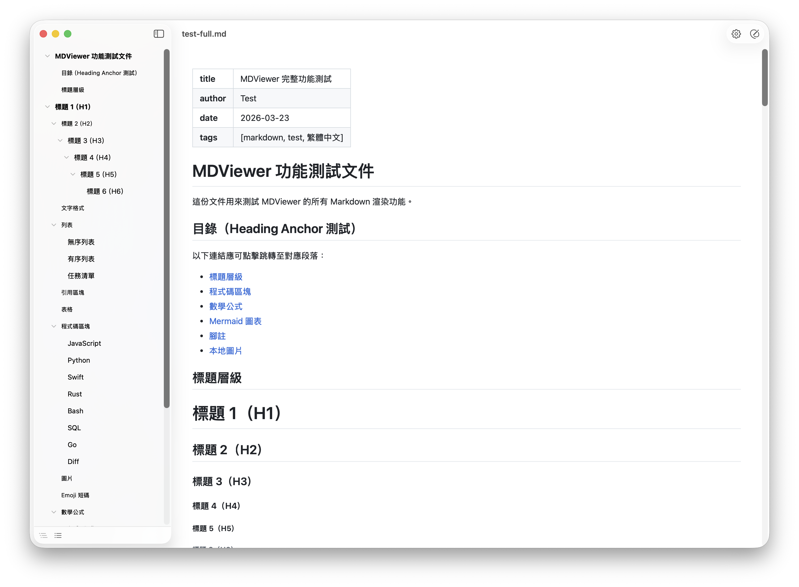
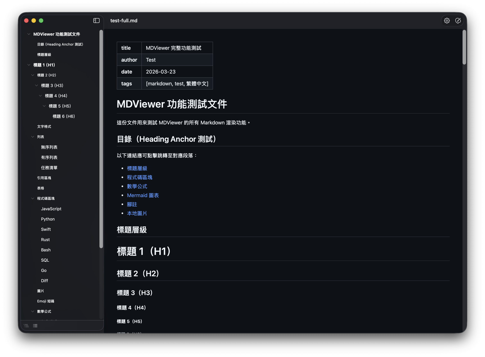
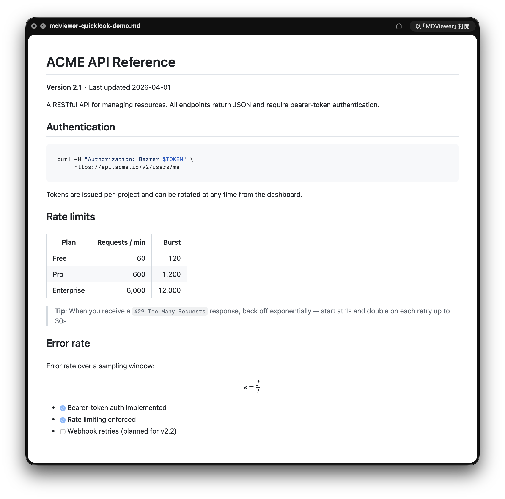

# MDViewer

<div align="center">


  

**macOS 原生 Markdown 檢視器，支援 Quick Look — 極簡、快速、離線、免費**

按兩下任何 `.md` 檔案即可看到美觀的渲染結果，或在 Finder 中按**空白鍵**即時 Quick Look 預覽。GitHub 風格 Markdown、數學公式、Mermaid 圖表，皆為原生渲染。沒有編輯器的負擔、不用設定、無需網路。專心閱讀就好。

繁體中文 | [English](README.md)

</div>

---

## 截圖

<div align="center">

**主視窗** — GitHub 風格渲染搭配目錄側邊欄，自動淺色 / 深色主題切換

<table>
<tr>
<td></td>
<td></td>
</tr>
</table>

**Quick Look** — 在 Finder 中於任意 `.md` 檔案按空白鍵即可即時預覽


</div>

---

## 這是給誰用的？

macOS 沒有內建的 Markdown 渲染工具 — 用「預覽程式」打開 `.md` 只會看到原始碼。MDViewer 填補這塊：原生、專注的閱讀器，在 Finder 按兩下檔案或按空白鍵就能美觀地呈現 `.md`。

**類似工具：**
- **只需要 Quick Look？** [QLMarkdown](https://github.com/sbarex/QLMarkdown) 是開源的 Quick Look 擴充。MDViewer 同樣提供 Quick Look，並多了獨立閱讀視窗，內建目錄側邊欄、頁內搜尋、PDF/HTML 匯出與縮放。
- **想編輯 Markdown？** 可以試試 [Obsidian](https://obsidian.md)、[Typora](https://typora.io)、[iA Writer](https://ia.net/writer)、[MacDown](https://macdown.uranusjr.com) 或 [VS Code](https://code.visualstudio.com)。讓 MDViewer 維持為 `.md` 預設開啟程式，在 MDViewer 內指定任一款作為外部編輯器，按 ⇧⌘E 即可開啟目前檔案編輯 — 存檔後 MDViewer 會即時刷新內容。

---

## 功能

- **GitHub 風格渲染** — 標題、表格、任務清單、刪除線、引用區塊
- **語法高亮** — 透過 highlight.js 支援常見程式語言
- **數學公式** — `$...$` 行內、`$$...$$` 區塊、` ```math ` 程式碼區塊（Temml / MathML）
- **Mermaid 圖表** — 流程圖、序列圖等（延遲載入）
- **腳註** — `[^1]` 語法，支援可點擊的回溯連結
- **Emoji 短碼** — `:rocket:` → 🚀
- **Quick Look** — 在 Finder 中選取 `.md` 按空白鍵即可預覽，支援內嵌本地圖片
- **目錄側邊欄** — 可收合的標題導覽，點擊即跳轉
- **頁內搜尋** — ⌘F 開啟搜尋列，支援符合項高亮與上一個／下一個導覽
- **匯出** — 儲存為 PDF 或獨立 HTML（所有 JS/CSS 內嵌），或透過系統列印對話框列印
- **Copy as Markdown** — 以右鍵選單或 ⇧⌘C 複製目前選取範圍的原始 Markdown 原始碼（以區塊為單位），可直接貼到 GitHub、Slack 或任何 Markdown 編輯器。選取為空時不動作。
- **程式碼區塊一鍵複製** — 每個渲染後的程式碼區塊角落都有複製按鈕
- **檢查更新** — 選單提供手動更新檢查，與 GitHub 最新 release 比對版本
- **CJK 支援** — 完整 UTF-8，支援中文、日文、韓文
- **離線使用** — 所有相依套件皆已打包，零網路請求（僅手動檢查更新時連線）

---

## 鍵盤快捷鍵

| 快捷鍵 | 功能 |
|---|---|
| ⌘O | 開啟檔案 |
| ⇧⌘E | 以外部編輯器開啟 |
| ⌘E | 匯出為 PDF |
| ⌘P | 列印 |
| ⇧⌘C | 複製選取範圍為 Markdown |
| ⌘F | 頁內搜尋 |
| ⌘, | 切換設定面板 |
| ⇧⌘S | 切換目錄側邊欄 |
| ← / → | 收合 / 展開目錄標題 |
| ⌘+ / ⌘− | 放大 / 縮小 |
| ⌘0 | 實際大小 |
| 空白鍵（Finder 中） | Quick Look 預覽 |

---

## 安裝

### Homebrew（建議）

```bash
brew tap ff2248/mdviewer
brew install --cask mdviewer
```

### 從原始碼編譯

需要 macOS 14+、Xcode 16+ 和 [xcodegen](https://github.com/yonaskolb/XcodeGen)（`brew install xcodegen`）。

```bash
git clone https://github.com/ff2248/md-viewer.git
cd md-viewer
make install
```

兩種方式都會安裝到 `/Applications` 並啟用 Quick Look 擴充功能。

### 首次開啟可能遇到的問題

MDViewer 目前以 ad-hoc 簽名發佈（尚未加入 Apple Developer Program，因此未經 Apple 公證），首次啟動會被 macOS Gatekeeper 阻擋。自 macOS Sequoia 起，在 Finder 按右鍵選「打開」也無法再繞過，請擇一處理：

- **系統設定（建議）**：開啟 **系統設定 → 隱私權與安全性**，於下方「安全性」區塊點擊 **「強制打開」**，再輸入密碼確認。
- **終端機一行指令**：`xattr -dr com.apple.quarantine /Applications/MDViewer.app`

### 升級

```bash
# Homebrew
brew upgrade mdviewer

# 從原始碼安裝的版本
git pull
make install
```

### 解除安裝

```bash
# Homebrew
brew uninstall mdviewer

# 從原始碼安裝的版本
make uninstall
```

### 其他開啟方式

| 方式 | 操作 |
|---|---|
| 按兩下開啟 | 開啟任意 `.md` 檔案（設為預設後） |
| 拖放 | 將 `.md` 檔案拖放到應用程式視窗 |
| 命令列 | `open -a MDViewer yourfile.md` |

### 設為預設檢視器

在任意 `.md` 檔案上按右鍵 → **取得資訊** → **打開檔案的應用程式** → 選擇 **MDViewer** → **全部更改**。

---

## 運作原理

**主應用程式**在 Swift 中透過 cmark-gfm 將 Markdown 解析為 HTML，再透過 JavaScriptCore 預先渲染語法高亮（highlight.js）與數學公式（Temml → MathML），最後將結果注入預載的 WKWebView。瀏覽器中不執行 JavaScript，唯一例外是 Mermaid（需要 DOM）。

**Quick Look 擴充功能**使用 `QLPreviewReply` 資料驅動 API，在沙盒環境內回傳內嵌所有 JS/CSS 的獨立 HTML 讓系統渲染。

`Shared/` 目錄存放主程式與 Quick Look 擴充功能共用的渲染管線與網頁資源，使預覽視窗與主視窗的呈現保持一致。

---

## 貢獻

```bash
make test      # 執行測試
make format    # 格式化 Swift 程式碼（需安裝：brew install swiftformat）
```

## 授權條款

[MIT](LICENSE) — 打包的第三方相依套件授權請參閱 [ThirdPartyNotices.txt](ThirdPartyNotices.txt)。
