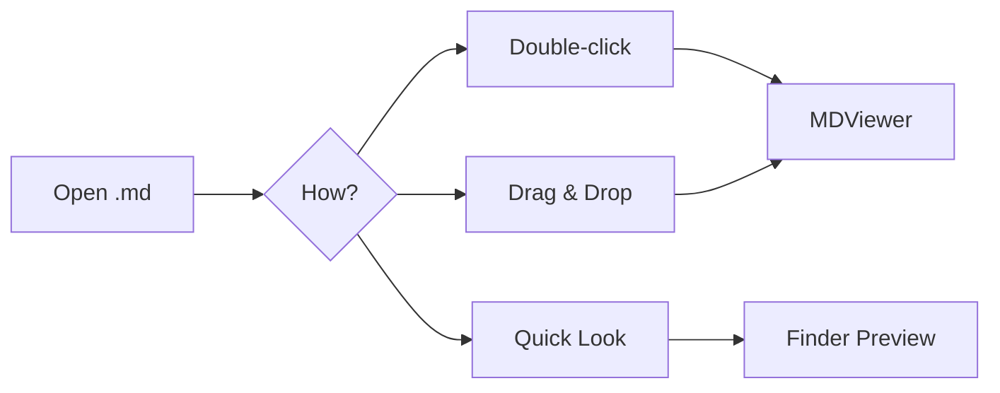

# MDViewer Feature Showcase

This document tests all MDViewer rendering features.

## Table of Contents

- [Code Highlighting](#code-highlighting)
- [Math Formulas](#math-formulas)
- [Mermaid Diagrams](#mermaid-diagrams)
- [Rich Text](#rich-text)

## Quick Comparison

| Feature | MDViewer | VS Code | QLMarkdown |
|---------|:-------:|:-------:|:----------:|
| Quick Look | Yes | No | Yes |
| Standalone viewer | Yes | Editor-based | Settings only |
| Math (offline) | KaTeX | Extension | MathJax (CDN) |
| Mermaid diagrams | Yes | Extension | Yes |
| License | MIT | Proprietary | GPLv3 |

## Code Highlighting

```python
from dataclasses import dataclass
from typing import Optional

@dataclass
class Document:
    title: str
    content: str
    tags: list[str]
    author: Optional[str] = None

    def word_count(self) -> int:
        return len(self.content.split())
```

```swift
struct MarkdownParser {
    static func toHTML(_ markdown: String) -> String {
        cmark_gfm_core_extensions_ensure_registered()
        guard let parser = cmark_parser_new(0) else { return "" }
        defer { cmark_parser_free(parser) }
        return String(cString: cmark_render_html(doc, options, ext)!)
    }
}
```

## Math Formulas

Euler's identity: $e^{i\pi} + 1 = 0$, quadratic formula: $x = \frac{-b \pm \sqrt{b^2 - 4ac}}{2a}$

$$\int_{0}^{\infty} e^{-x^2} dx = \frac{\sqrt{\pi}}{2}$$

```math
\sum_{k=0}^{n} \binom{n}{k} = 2^n
```

## Mermaid Diagrams



## Rich Text

- [x] GitHub-style rendering :white_check_mark:
- [x] Syntax highlighting :rocket:
- [x] Footnotes[^1] and emoji :tada:
- [ ] More features coming soon

> **Note:** MDViewer is offline-first — all dependencies are bundled. Zero network requests.

This is **bold**, *italic*, ~~strikethrough~~, and `inline code`.

[^1]: Footnotes are fully supported with clickable back-references.
