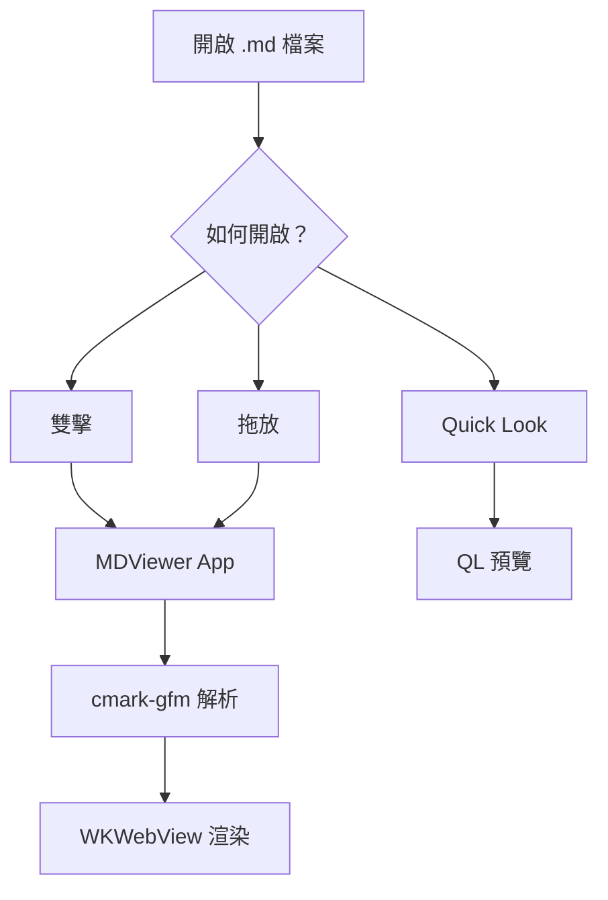
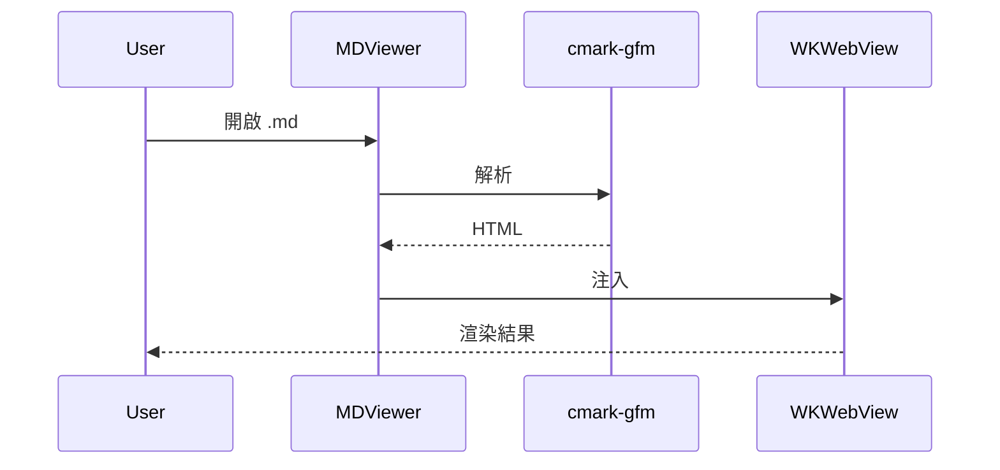

# MDViewer 功能測試文件

這份文件用來測試 MDViewer 的所有 Markdown 渲染功能。

## 標題層級

# 標題 1（H1）
## 標題 2（H2）
### 標題 3（H3）
#### 標題 4（H4）
##### 標題 5（H5）
###### 標題 6（H6）

---

## 文字格式

這是 **粗體**，這是 *斜體*，這是 ***粗斜體***，這是 ~~刪除線~~。

這是 `行內程式碼` 的範例。

這是一個[超連結](https://github.com)，以及一個自動連結：https://example.com

## 列表

### 無序列表
- 項目一
- 項目二
  - 巢狀項目 2a
  - 巢狀項目 2b
    - 更深層的巢狀
- 項目三

### 有序列表
1. 第一步
2. 第二步
3. 第三步

### 任務清單
- [x] 已完成的任務
- [ ] 未完成的任務
- [x] 另一個已完成的任務
- [ ] 記得測試 Quick Look

## 引用區塊

> 這是一段引用。
> 可以跨越多行。
>
> > 也可以巢狀引用。
> > > 甚至三層巢狀。

## 表格

| 功能 | 主 App | Quick Look | 備註 |
|------|:------:|:----------:|------|
| GFM 渲染 | ✅ | ✅ | cmark-gfm |
| 語法高亮 | ✅ | ✅ | highlight.js 35 語言 |
| 數學公式 | ✅ | ✅ | KaTeX |
| Mermaid | ✅ | 條件載入 | 延遲載入 2.8 MB |
| TOC 側邊欄 | ✅ | ❌ | 主 App 獨有 |

## 程式碼區塊

### JavaScript

```javascript
async function fetchMarkdown(url) {
  const response = await fetch(url);
  const text = await response.text();
  return { content: text, length: text.length };
}
```

### Python

```python
from dataclasses import dataclass
from typing import Optional

@dataclass
class Document:
    title: str
    content: str
    tags: list[str]
    author: Optional[str] = None

    def word_count(self) -> int:
        return len(self.content.split())
```

### Swift

```swift
struct MarkdownParser {
    static func toHTML(_ markdown: String) -> String {
        cmark_gfm_core_extensions_ensure_registered()
        guard let parser = cmark_parser_new(0) else { return "" }
        defer { cmark_parser_free(parser) }
        return String(cString: cmark_render_html(doc, options, extensions)!)
    }
}
```

### Rust

```rust
fn fibonacci(n: u64) -> Vec<u64> {
    let mut fib = vec![0, 1];
    for i in 2..n as usize {
        fib.push(fib[i - 1] + fib[i - 2]);
    }
    fib
}
```

### Bash

```bash
#!/bin/bash
echo "Building MDViewer..."
xcodegen generate && xcodebuild -scheme MDViewer build
echo "Done! Run: make install"
```

### SQL

```sql
SELECT u.name, COUNT(d.id) AS doc_count
FROM users u
LEFT JOIN documents d ON u.id = d.author_id
WHERE d.created_at > '2026-01-01'
GROUP BY u.name
ORDER BY doc_count DESC;
```

### Go

```go
func main() {
    http.HandleFunc("/render", func(w http.ResponseWriter, r *http.Request) {
        body, _ := io.ReadAll(r.Body)
        w.Write([]byte(renderMarkdown(string(body))))
    })
    log.Fatal(http.ListenAndServe(":8080", nil))
}
```

### Diff

```diff
- let html = MarkdownRenderer.assembleHTML(markdown: markdown)
+ let html = MarkdownParser.toHTML(markdown, unsafe: true)
```

## 圖片


## Emoji 短碼

:rocket: 發射！ :smile: 開心！ :thumbsup: 讚！ :warning: 注意！

:heart: 愛心 :star: 星星 :fire: 火焰 :bug: 蟲子 :tada: 慶祝

## 數學公式

### 行內公式

質能等價公式：$E = mc^2$

歐拉公式：$e^{i\pi} + 1 = 0$

二次方程式：$x = \frac{-b \pm \sqrt{b^2 - 4ac}}{2a}$

### 區塊公式

$$\sum_{i=1}^{n} x_i = x_1 + x_2 + \cdots + x_n$$

$$\int_{0}^{\infty} e^{-x^2} dx = \frac{\sqrt{\pi}}{2}$$

## Mermaid 圖表

### 流程圖



### 序列圖



## HTML 嵌入

<details>
<summary>點擊展開隱藏內容</summary>

這是隱藏的內容。支援 **Markdown** 語法。

</details>

<div style="padding: 16px; background: #f0f7ff; border-left: 4px solid #0366d6; border-radius: 4px;">
💡 <strong>提示：</strong>MDViewer 使用 tagfilter 自動過濾危險 HTML 標籤。
</div>

## 繁體中文測試

Markdown 是一種輕量級標記語言，由 John Gruber 於 2004 年創建。GitHub Flavored Markdown（GFM）是 GitHub 對標準 Markdown 的擴充，增加了表格、任務清單、刪除線等功能。MDViewer 使用 GitHub 官方的 cmark-gfm 解析器，確保渲染結果與 GitHub 上看到的完全一致。

中日韓混合：**繁體中文**、日文（こんにちは）、韓文（안녕하세요）。

---

*測試完畢。*
