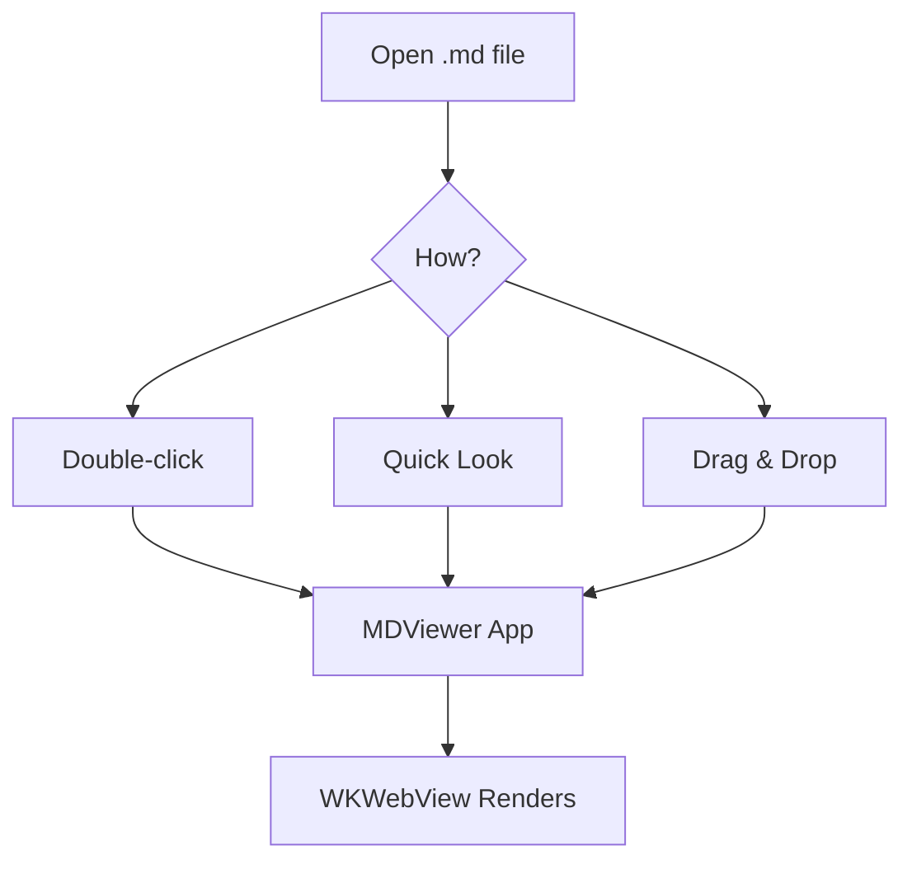

# Heading 1
## Heading 2
### Heading 3
#### Heading 4
##### Heading 5
###### Heading 6

---

## Text Formatting

This is **bold**, this is *italic*, this is ***bold italic***, and this is ~~strikethrough~~.

This is `inline code` within a sentence.

## Lists

### Unordered
- Item 1
- Item 2
  - Nested item 2a
  - Nested item 2b
- Item 3

### Ordered
1. First
2. Second
3. Third

### Task List
- [x] Completed task
- [ ] Incomplete task
- [x] Another completed task

## Links and Images

[Visit GitHub](https://github.com)


## Blockquote

> This is a blockquote.
> It can span multiple lines.
>
> > And can be nested.

## Table

| Name | Language | Stars |
|------|----------|-------|
| MDViewer | Swift | 0 |
| QLMarkdown | C++/Swift | 2450 |
| Marked 2 | Proprietary | N/A |

## Code Blocks

```javascript
function greet(name) {
  console.log(`Hello, ${name}!`);
  return { greeting: `Hello, ${name}!` };
}
```

```python
def fibonacci(n: int) -> list[int]:
    a, b = 0, 1
    result = []
    for _ in range(n):
        result.append(a)
        a, b = b, a + b
    return result
```

```swift
struct ContentView: View {
    var body: some View {
        Text("Hello, World!")
            .font(.title)
            .foregroundColor(.blue)
    }
}
```

```bash
#!/bin/bash
echo "Building MDViewer..."
xcodebuild -project MDViewer.xcodeproj -scheme MDViewer build
```

## Emoji

:rocket: Launch! :smile: Happy! :thumbsup: Approved! :warning: Caution!

## Math Formulas

Inline math: $E = mc^2$

Display math:

$$\sum_{i=1}^{n} x_i = x_1 + x_2 + \cdots + x_n$$

$$\int_{0}^{\infty} e^{-x^2} dx = \frac{\sqrt{\pi}}{2}$$

## Mermaid Diagram



## HTML in Markdown

<details>
<summary>Click to expand</summary>

This is hidden content revealed by clicking the summary.

</details>

<div style="padding: 10px; background: #f0f0f0; border-radius: 5px;">
  Custom styled HTML block
</div>
